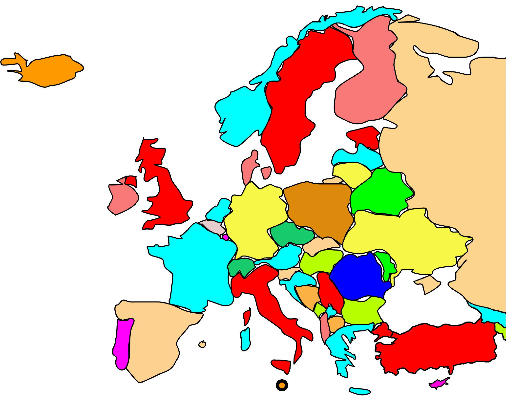

```{r setup, include=FALSE}
knitr::opts_chunk$set(echo = TRUE)
```

## Motivation

I can't draw by hand so I want to draw this map with `R`. https://commons.wikimedia.org/wiki/File:Hand-Drawn_Map_of_Europe.svg 

 

## Entities of Europe 

```{r }
library(tidyverse)
library(sf)
library(rnaturalearth)
```


We work with all entities falling even partially under any of the various common definitions of Europe, geographical or political. https://en.wikipedia.org/wiki/Europe . 
Names as used in `rnaturalearth`. 

```{r}
sovereignties <- c(
"Albania", "Andorra", "Armenia", "Austria", "Azerbaijan", "Belarus", "Belgium", "Bosnia and Herzegovina", "Bulgaria", "Croatia", "Cyprus", "Czech Republic", "Denmark", "Estonia", "Finland", "France", "Georgia", "Germany", "Greece", "Hungary", "Iceland", "Ireland", "Italy", "Kazakhstan", "Latvia", "Liechtenstein", "Lithuania", "Luxembourg", "Macedonia", "Malta", "Moldova", "Monaco", "Montenegro", "Netherlands", "Norway", "Poland", "Portugal", "Republic of Serbia", "Romania", "Russia", "San Marino", "Slovakia", "Slovenia", "Spain", "Sweden", "Switzerland", "Turkey", "Ukraine", "United Kingdom", "Vatican")

europe <- ne_countries(scale = "medium", returnclass = "sf", sovereignty = sovereignties) %>%
    select(sovereignt)
```


```{r}
europe %>% ggplot() +
  geom_sf() +
  coord_sf(xlim = c(-23, 40), ylim = c(33, 70)) 
```

## Add colours

```{r}
library(igraph)
library(visNetwork)
json <- jsonlite::fromJSON("neighbours.json")
json
```


```{r}
json %>% slice(1)  %>% select(neighbours) %>% 
    first()
```


```{r}

countries <- json %>% select(country) %>% pull()

neighbours <- tibble()
for (cnt in countries) {
  row <- json %>% filter(country == cnt) %>% select(neighbours) %>% pull() %>% 
    first() %>% mutate(country = cnt)
  neighbours <- neighbours %>% bind_rows(row)
}

d <- neighbours %>% select(country, neighbour)
countries <- union(neighbours %>% select(country)  %>% distinct() %>% pull(),
                   neighbours %>% select(neighbour)  %>% distinct() %>% pull())
igraph_network <- graph_from_data_frame(d = d, vertices = countries, directed = F)
```
```{r}
plot(igraph_network)
```
```{r}
E(igraph_network)
V(igraph_network)
E(igraph_network)
igraph_network[]
diam <- get_diameter(igraph_network, directed=T)
diam
```
```{r}
# visNetwork
data <- toVisNetworkData(igraph_network)
visNetwork(nodes = data$nodes, edges = data$edges, height = "500px")

data$nodes <- greedy_vertex_coloring(
  igraph_network, 
  heuristic = c("colored_neighbors")) %>% 
  tibble(label = names(.),
       col_id = .) %>%
  left_join(tibble(col_id = c(1:5),
                   color = c("#f0e442ff", "#009e73ff", "#d55e00ff", "#0072b2ff", "#44b9bfff"))) %>%
  select(label, color) %>% mutate(id = label)


data$edges <- neighbours %>% rename(from = country, to = neighbour) %>% 
  mutate_at(c('type'), ~replace_na(., "B"))  %>%
  left_join(tibble(type = c("B", "M", "L"),
                   color = c("red", "blue", "green")))

visNetwork(nodes = data$nodes, edges = data$edges, width = "1000px", height = "1000px") %>% 
  visOptions(highlightNearest = TRUE, nodesIdSelection = TRUE)

```


## Cartoon map

```{r}
inx_dxf <- tempfile("inx_", fileext = c(".dxf"))
europe %>%
  st_geometry() %>%
  st_write(dsn = inx_dxf, driver ="DXF")
# canvas 
canvas <- matrix(c(-23, 30,
                   -23, 73,
                   45, 73,
                   45, 30,
                   -23, 30),ncol=2, byrow=TRUE) %>%
  list() %>% st_polygon() %>% st_sfc() %>% st_sf()
europe <- st_read(inx_dxf) %>% select(geometry) %>%
  st_intersection(canvas)
```


```{r}
# offset
europe <- europe %>% 
  mutate(geometry = st_buffer(geometry, dist = -.1)) %>%
  mutate(geometry = st_simplify(geometry)) %>%
  mutate(area = st_area(geometry)) %>%
  filter(area > 0.1)

europe %>% ggplot() +
  geom_sf() #+ theme_void()

# write svg
#europe %>% inx_sf2svg() %>% inx_write("/cartoon/europe.svg")
```

